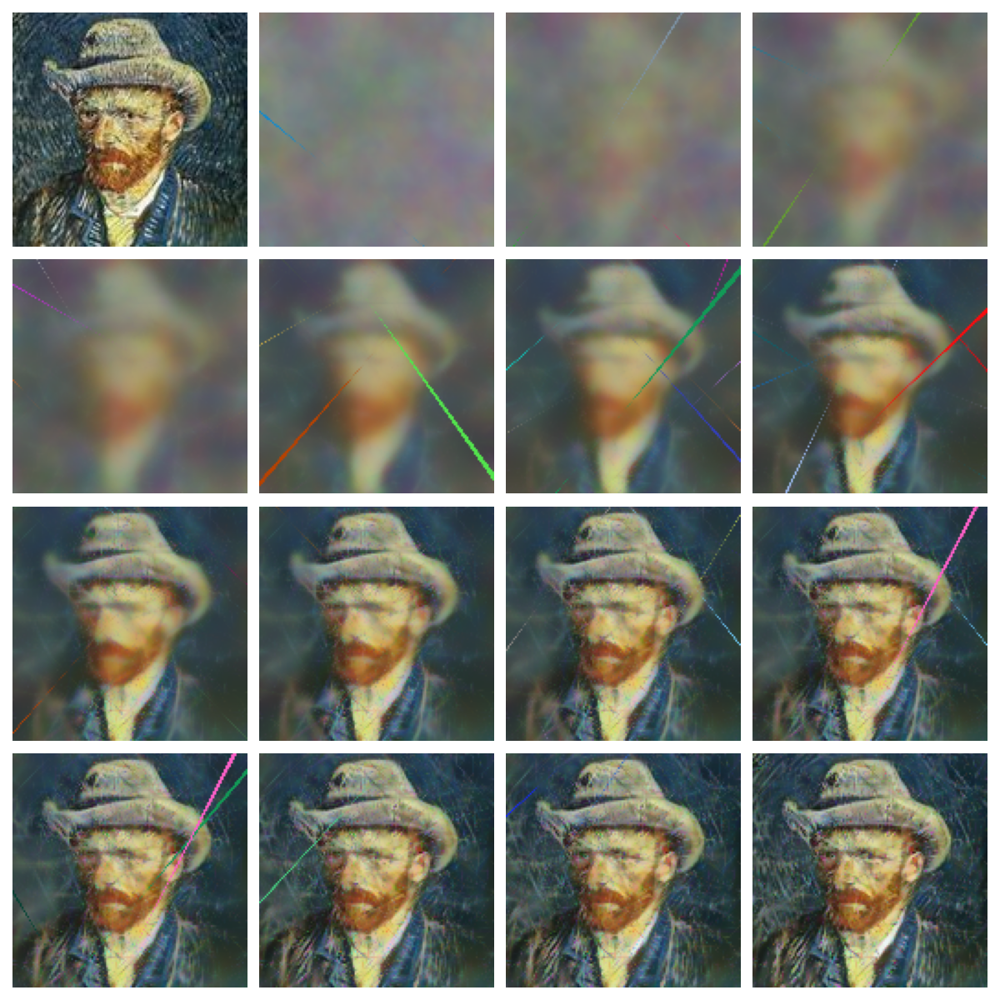
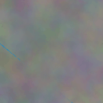

# A Toy Example of 2D Gaussian Splatting in JAX

## How to run
```
uv init
uv add "jax[cuda12]" numpy pillow optax matplotlib imageio
uv run main.py
```

## Training progress

The first image is the target image.



## Animation


